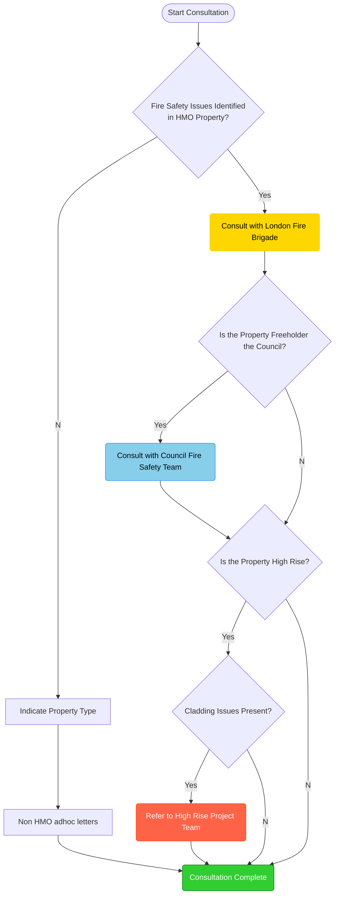

---
{"dg-publish":true,"permalink":"/ai-for-boring-work/fire-consultation/","tags":["linux","Mermaid"]}
---

```mermaid
flowchart TD
    start(["Start Consultation"])
    LFB("Consult with London Fire Brigade")
    notice{"Fire Safety Issues Identified
    in HMO Property?"}
    property[ Indicate Property Type]
    nonhmo[Non HMO adhoc letters]
    council{"Is the Property Freeholder the Council?"}
    councilConsult("Consult with Council Fire Safety Team")
    highRise{"Is the Property High Rise?"}
    cladding{"Cladding Issues Present?"}
    addressIssues("Refer to High Rise Project Team")
    complete("Consultation Complete")
    start --> notice
    notice --No-->property --> nonhmo --> complete
    notice --Yes--> LFB --> council
    council --Yes--> councilConsult
    council --No--> highRise
    highRise --Yes--> cladding
    cladding --Yes--> addressIssues
    cladding --No--> complete
    councilConsult --> highRise
    highRise --No--> complete
    addressIssues --> complete
    style LFB fill:#FFD700, stroke:#FFD400, color:#000000
    style councilConsult fill:#87CEEB, stroke:#1E90FF, color:#000000
    style addressIssues fill:#FF6347, stroke:#FF4500, color:#FFFFFF
    style complete fill:#32CD32, stroke:#008000, color:#FFFFFF
```
